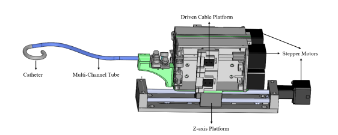
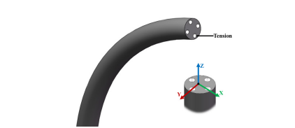
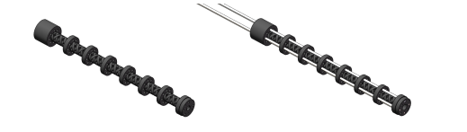
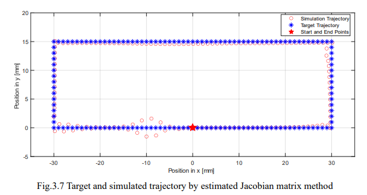
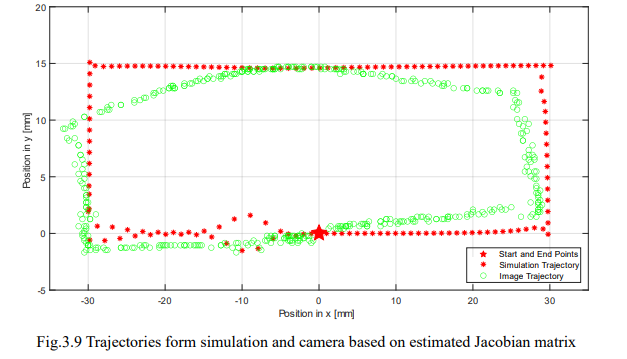
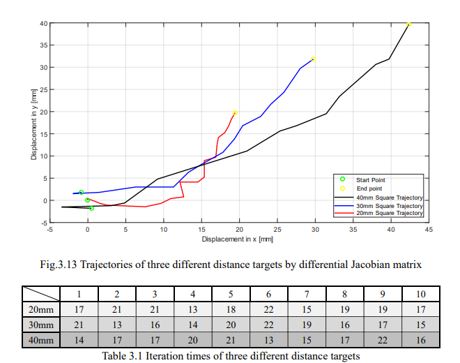

[View my master degree theisis <i class="fas fa-file-pdf"></i>](./MingcongChen_19007740_HongbinLiu_FinalReport_2019-20.pdf)
The flexible endoscopic robot has shown great potential in minimally invasive surgery. Compared with conventional open surgery, The endoscopic robot will cause less pain and lower bleeding rates which can help patients recover faster. However, the current endoscopic robot system relies on the surgeon too much that will lead to the lack of surgeon resources and cause danger when the surgeon is getting tired after long-duration operations. Moreover, with the development of 5G, the discussion about the benefit of remote surgery has been revealed to the public. Especially in today's medical situation, due to the coronavirus, the remote surgical system becomes more and more important. At present, there are already several soft manipulators based on cable drive that has been developed, which allows an accurate movement and force control resulting in safety risk for the patient. To give a more straightforward model for the robot, a helix mesh design of the robot’s tip is investigated in this project. A cable-driven actuation system is also developed with a Wi-Fi-based remote controller system. To realize accurate control, the soft robot in this project is modeled by constant curvature to set up the relationship between working space, joint space, and actuator space. Moreover, an inverse kinematics model can solve the visual servoing task is demonstrated based on the differential Jacobian matrix and the estimated Jacobian matrix. All the algorithms are tested in a simulated experiment, and a physical robot experiment for target guided controlling, which shows the desired stable movement. Furthermore, the visual servoing of the soft robot is validated using a painted target showing adequately accurate movement and linear behavior. As an inspiration result, an external contact location estimation algorithm is discussed by an experiment based on visual servoing.The expected work in the future is the combination with a haptic sensor on the tip of the robot 
to give a duel-feedback control and the hyper-remote control based on a 5G modular.

## Robot System Design
Soft Robot

End Effector

## Result

