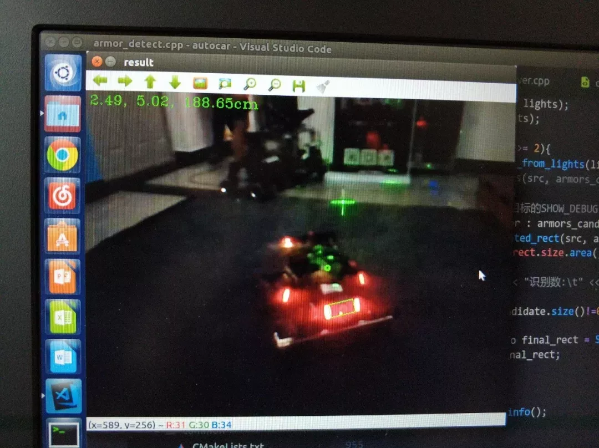

## IROBOT Team
The team has 30 members (10 R&D engineers, the rest of them are responsible for robot architecture processing and daily operation of the team). The team independently designed 7 fully automatic and semi-automatic robots from three aspects of Mechanics, Robot Controlling and Robot Vision. At present, the team has formed a scale, with three sponsors, five CNC metal engraving machines, twenty one 3D printers, and a systematic outsourcing processing chain. A complete training system for new recruits has been established, and a summer camp called Xidian Robots camp has been established. It has been incorporated into the school innovation and Entrepreneurship Week curriculum, recruiting summer campers for freshmen and recruiting outstanding people into the battle team.

As one of the funder of the team, the member of Robot Vision group, chef developer of standarder Robot’s Vision Algorithm System. Based on C++, OpenCV, Caffe developed an auto-aiming system which can detect the armor of enemy robots to realize auto-shooting function and competition field rune detection and auto-shooting system. Take the role of team projects managements and joint tests. In the summer camp, to serve as the interviewer of software algorithms.

