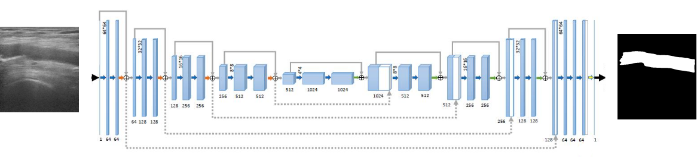
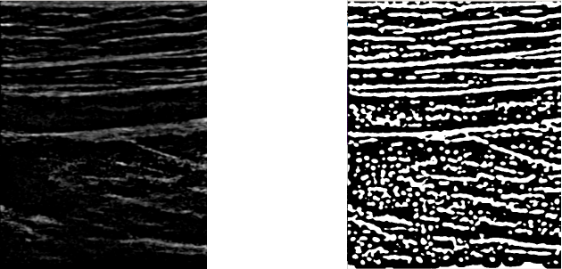
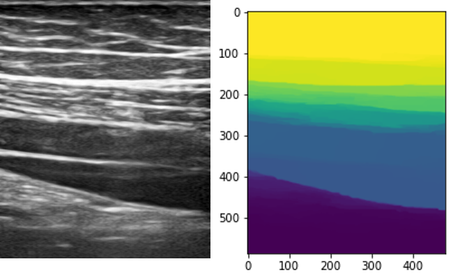

**For this project, a paper is planed to write based on current result**

## Vessel detection
I developed a Real-time vessel and vessel wall detection (main for artery) with an U-Net structure Fully Convolution Network and vessel wall enhancement. The detection result can guide the movement of the robot.

The vessel detection result is shown below:



## Robot Scanning

To make sure the contact between Ultrasound probe and the leg, the impendance control with a 6-axis force sensor is used for z-axis control.

To know wether the ultrasound image is usable, the iamge is calculated into confidence map to eveluate the qulity. Hence we can adjust the rotation of the probe to get a more confident (clear) image.

